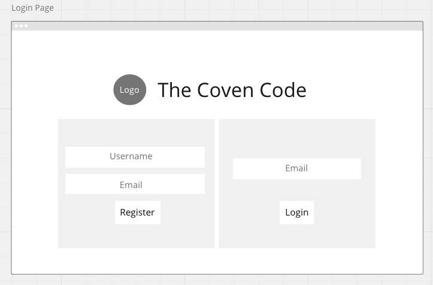
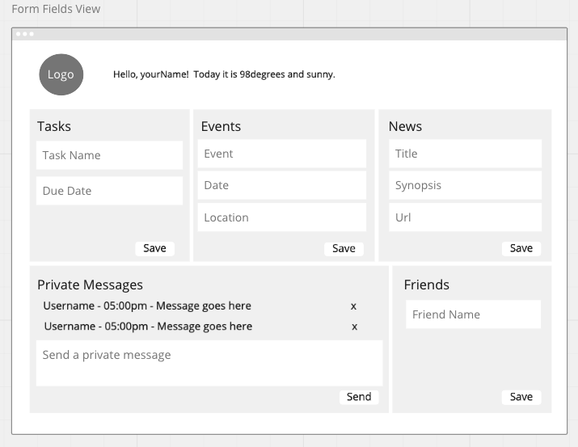

Wireframes:




# The Coven Code Delivers **Nutshell: The Information Dashboard**
Nutshell/Halloween Edition is a dashboard for ~~people~~ witches to organize their daily tasks, events, news article, friends, and chat messages. 

## Pulling From Our Pool of Knowledge:

1. Functions
1. Databases
1. Github
1. Objects
1. CSS/Flexbox
1. Array methods
1. Components
1. Handling user events
1. Implementing CRUD operations
1. Relational data
1. ERDs

# Getting Started

## Dependencies: 
* JSON Server
* GitHub

## Installing
### Setup: Follow these steps exactly

1. Clone this repository
1. `cd` into the directory it creates
1. Make a `database.json` file in the `api` directory
1. Copy and paste these data into `database.json`
1. Have fun creating your user!

*:crystal_ball: note: you may need to adjust dates in given objects to show in the current time of the world*

```{
  "users": [
    {
      "id": 1,
      "username": "Broomhilda",
      "email": "ridingbroomssince2003@yahoo.com",
      "zipcode": 32541
    },
    {
      "id": 2,
      "username": "Starla",
      "email": "startlingstarla@witchcoventry.com",
      "zipcode": 32004
    },
    {
      "id": 3,
      "username": "Vikki",
      "email": "vikkiwitchboss@witchywarren.com",
      "zipcode": 33166
    },
    {
      "id": 4,
      "username": "Sabrina",
      "email": "teenagewitch@yahoo.com",
      "zipcode": 33166
    },
    {
      "id": 5,
      "username": "Glenda",
      "email": "thegoodwitch@oz.com",
      "zipcode": 33166
    },
    {
      "username": "HauntedHannah",
      "email": "hannah4pointoh@gmail.com",
      "zipcode": 61820,
      "id": 6
    }
  ],
  "friends": [
    {
      "id": 1,
      "myUserId": 2,
      "userId": 1
    },
    {
      "id": 2,
      "myUserId": 1,
      "userId": 3
    },
    {
      "id": 3,
      "myUserId": 3,
      "userId": 2
    },
    {
      "id": 4,
      "myUserId": 2,
      "userId": 5
    },
    {
      "id": 5,
      "myUserId": 5,
      "userId": 3
    },
    {
      "id": 6,
      "myUserId": 1,
      "userId": 4
    },
    {
      "myUserId": 2,
      "userId": 3,
      "id": 7
    }
  ],
  "posts": [
    {
      "post": "Meet me on the beach's edge at the witching hour.",
      "originalTimeStamp": 1601318302601,
      "editedTimeStamp": 0,
      "userId": 2,
      "id": 3
    },
    {
      "post": "I'll bring the cauldron.",
      "originalTimeStamp": 1601318355949,
      "editedTimeStamp": 0,
      "userId": 1,
      "id": 4
    },
    {
      "post": "Hats are encouraged, but not required...",
      "originalTimeStamp": 1601318413280,
      "editedTimeStamp": 0,
      "userId": 2,
      "id": 5
    },
    {
      "post": "Don't forget to charge your crystals by the light of the full moon!",
      "originalTimeStamp": 1601318452307,
      "editedTimeStamp": 0,
      "userId": 3,
      "id": 6
    },
    {
      "post": "I've got my granny's spell book!",
      "originalTimeStamp": 1601318501717,
      "editedTimeStamp": 0,
      "userId": 5,
      "id": 7
    },
    {
      "post": "Yes!!!! I am so excited. What should we plan in the meantime?",
      "originalTimeStamp": 1601332869086,
      "editedTimeStamp": 0,
      "userId": 3,
      "id": 8
    },
    {
      "post": "BEACH DAY! am I right?!",
      "originalTimeStamp": 1601333137661,
      "editedTimeStamp": 0,
      "userId": 2,
      "id": 9
    },
    {
      "post": "witch, you know it's true!",
      "originalTimeStamp": 1601333179366,
      "editedTimeStamp": 0,
      "userId": 1,
      "id": 10
    },
    {
      "post": "I'm in!",
      "originalTimeStamp": 1601346037959,
      "editedTimeStamp": 0,
      "userId": 3,
      "id": 11
    }
  ],
  "tasks": [
    {
      "id": 2,
      "name": "pack cauldron",
      "complete": false,
      "dueDate": "2020-10-30",
      "userId": 1
    },
    {
      "id": 3,
      "name": "cast weather spell for the 31st",
      "complete": false,
      "dueDate": "2020-10-30",
      "userId": 2
    },
    {
      "id": 4,
      "name": "laundry",
      "complete": false,
      "dueDate": "2020-10-29",
      "userId": 2
    },
    {
      "id": 5,
      "name": "grocery shopping",
      "complete": false,
      "dueDate": "2020-10-27",
      "userId": 3
    },
    {
      "id": 6,
      "name": "recast '25 hour day' spell",
      "complete": false,
      "dueDate": "2020-10-24",
      "userId": 3
    },
    {
      "id": 7,
      "name": "litter box spell",
      "complete": false,
      "dueDate": "2020-10-25",
      "userId": 4
    },
    {
      "id": 8,
      "name": "charge crystals",
      "complete": false,
      "dueDate": "2020-10-29",
      "userId": 4
    },
    {
      "id": 9,
      "name": "find Granny's spellbook",
      "complete": false,
      "dueDate": "2020-10-29",
      "userId": 5
    },
    {
      "id": 10,
      "name": "forage for herbs",
      "complete": false,
      "dueDate": "2020-10-28",
      "userId": 5
    },
    {
      "name": "go to the apothecary",
      "complete": false,
      "dueDate": "2020-10-03",
      "userId": 2,
      "id": 11
    },
    {
      "name": "smudge the front room again. the ghost is back",
      "complete": false,
      "dueDate": "2020-10-01",
      "userId": 2,
      "id": 12
    },
    {
      "name": "bury the dog in the cemetery",
      "complete": false,
      "dueDate": "2020-10-02",
      "userId": 5,
      "id": 13
    },
    {
      "name": "buy new broomstick",
      "complete": true,
      "dueDate": "2020-10-02",
      "userId": 1,
      "id": 15
    }
  ],
  "events": [
    {
      "id": 1,
      "name": "Seance",
      "date": "2020-11-1",
      "time": "02:30",
      "locationName": "Okaloosa Island, Fort Walton Beach",
      "zipcode": 32541,
      "userId": 2
    },
    {
      "name": "Midnight Moon Watch",
      "date": "2020-09-30",
      "time": "00:01",
      "locationName": "Destin Beach",
      "zipcode": "32540",
      "userId": 1,
      "id": 4
    },
    {
      "name": "Midnight Howl",
      "date": "2020-09-30",
      "time": "00:00",
      "locationName": "2nd Street",
      "zipcode": "37542",
      "userId": 1,
      "id": 5
    }
  ],
  "news": [
    {
      "id": 1,
      "url": "https://www.theatlantic.com/magazine/archive/2020/03/witchcraft-juliet-diaz/605518/",
      "title": "Why Witchcraft Is on the Rise",
      "synopsis": "Americans’ interest in spell-casting tends to wax as instability rises and trust in establishment ideas plummets.",
      "currentTimeStamp": "4:54pm",
      "userId": 4
    },
    {
      "id": 1,
      "url": "https://www.wweek.com/culture/2020/02/12/portland-is-the-best-place-in-the-country-to-be-a-witch/",
      "title": "Portland Is the Best Place in the Country to Be a Witch",
      "synopsis": "Even outside of spooky season, Portland is a place of magic—a town where, if you want to turn witchiness into a way of life, there are plenty of resources at your disposal.",
      "currentTimeStamp": "5:25pm",
      "userId": 5
    },
    {
      "id": 1,
      "url": "https://www.distractify.com/p/viral-obituary-witchy",
      "title": "Woman's Wonderfully Witchy Obituary Goes Completely Viral",
      "synopsis": "You might not have known Holly Blair, but once you read her obituary, you will wish that you were best friends before she died. Her brief obituary has gone completely viral because it is hilarious, witchy, and somehow optimistic.",
      "currentTimeStamp": "1:11am",
      "userId": 1
    },
    {
      "url": "https://www.independent.co.uk/arts-entertainment/books/features/witchcraft-astrology-modern-witch-guide-happiness-book-luna-bailey-a9276886.html",
      "title": "I spent a week becoming a witch and the results were worrying",
      "synopsis": "Inspired by Luna Bailey’s new book ‘The Modern Witch’s Guide to Happiness’, our columnist Ceri Radford set herself a New Year, New Me challenge",
      "currentTimeStamp": 1601319983938,
      "userId": 2,
      "id": 2
    },
    {
      "url": "https://www.nytimes.com/2019/10/11/style/pam-grossman-witch-feminism.html",
      "title": "Witches Are Having Their Hour",
      "synopsis": "Pam Grossman, author and host of the popular ",
      "currentTimeStamp": 1601332939400,
      "userId": 3,
      "id": 3
    }
  ]
}```


## Authors

* Audrey Thomasson
* Hanako Hashiguchi
* Tristan Wyatt 
* Sam Edwards
* Terra Roush

